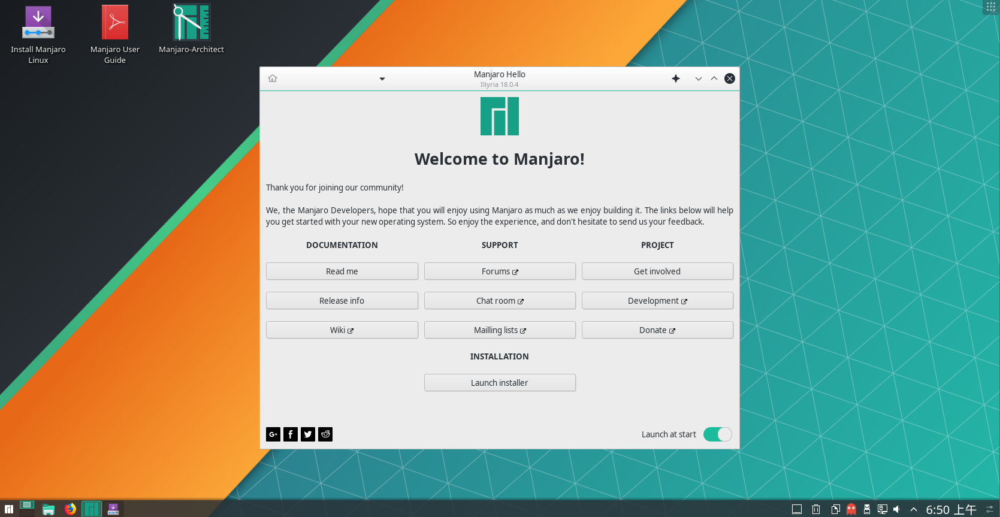
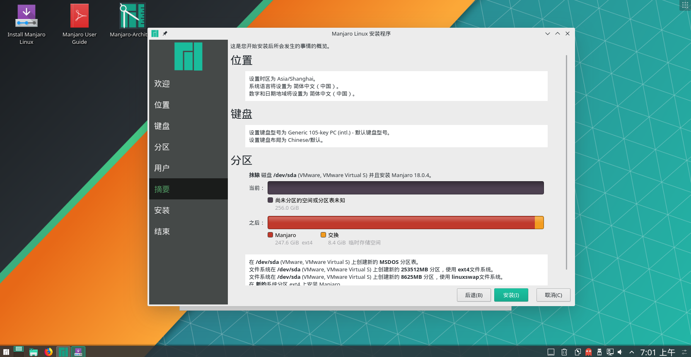

# 安装manjaro系统
### 一.下载
#### 1.地址：https://www.manjaro.cn/category/download-manjaro
推荐中科大源，本文选择kde桌面环境
### 二.使用vmware
#### 1.选择linux内核最高的版本
### 三.正式安装
#### 1.时区，语言更改，boot处enter启动,等待启动安装向导
#### 2.点击launch installer

#### 3.相关安装选项默认,有需求可以分区，等待安装

### 四.基础配置
#### 1.更换源
    sudo pacman-mirrors -i -c China -m rank //选择国内源
    sudo pacman -Syy //刷新缓存
#### 2.定位archlinuxcn源
    kate /etc/pacman.conf
    //在打开的文件加入下面两行
    [archlinuxcn] 
    Server = https://mirrors.ustc.edu.cn/archlinuxcn/$arch //此处用的是中科大的源
    //别忘了要同步
    sudo pacman -Sy archlinuxcn-keyring